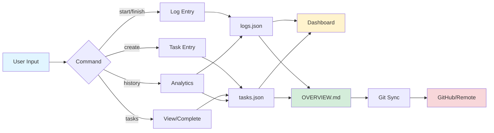

# Lifelog

A simple and beautiful CLI tool for tracking how your life is going. Start your day with intention, track your progress, and reflect on your accomplishments—all from your terminal.

```
┌─────────────────────────────────────────────────────────┐
│                   🌅 Start Your Day                     │
│  Sleep Quality • Gratitude • Daily Goals                │
│                          ↓                              │
│                   📋 Track Tasks                         │
│      Create • Complete • Monitor Progress                │
│                          ↓                              │
│                   🌙 Finish Your Day                     │
│   Day Rating • Productivity • Daily Overview             │
│                          ↓                              │
│              📊 View Dashboard & History                 │
│   Analytics • Trends • Insights • OVERVIEW.md            │
└─────────────────────────────────────────────────────────┘
```

## Features

- **Morning & Evening Logging**: Start your day with gratitude and goals, finish with reflection and overview
- **Task Management**: Create and track daily tasks throughout the day
- **Comprehensive Journaling**: Write detailed overviews of your day with an integrated text editor
- **History & Analytics**: View your logs with filtering by day, week, month, or custom ranges
- **Beautiful Dashboard**: See an overview of your day at a glance
- **File-based Storage**: All your data is stored locally in JSON files in `~/.lifelog/`
- **Auto-generated Overview**: Creates a beautiful markdown file (`OVERVIEW.md`) of your recent entries that you can view on GitHub

## Installation

### From npm (when published)

```bash
npm install -g lifelog
```

### Local Development

```bash
git clone https://github.com/hughgramel/lifelog.git
cd lifelog
npm install
npm link
```

This will make the `log` command available globally on your system.

## Usage

### Recommended Daily Workflow

#### 1. Start Your Day (Morning)

```bash
log start
```

Begin each morning by:
- Rating how well you slept last night
- Writing one sentence about what you're grateful for
- Setting your goals/intentions for the day

#### 2. Track Tasks Throughout the Day

Create tasks as they come up:

```bash
log create "Clean room"
log create "Finish project report"
log create "Call mom"
```

View and mark tasks complete:

```bash
log tasks
```

#### 3. Finish Your Day (Evening)

```bash
log finish
```

End your day with reflection:
- Rate your day (1-10)
- Rate your productivity (1-5)
- Write a comprehensive 1-2 paragraph overview of what happened today
- Automatically tracks how many tasks you completed

### Dashboard

Check your current status anytime:

```bash
log
```

This shows:
- Today's log status (morning/evening entries)
- Today's tasks and completion count
- 7-day trends
- Quick action links

### Quick Log (Legacy)

For a simpler logging experience without the morning/evening split:

```bash
log log
```

**Note**: We recommend using `log start` and `log finish` for the full experience!

### Create Tasks

Create a new task for today:

```bash
log create "Clean room"
log create "Finish project report"
```

### View Tasks

See all tasks for today and mark them as complete:

```bash
log tasks
```

This command will:
- Show all tasks for today
- Display completion status
- Allow you to mark tasks as complete interactively

### View History

Browse your historical logs with various time ranges:

```bash
log history
```

Choose from:
- Today
- Yesterday
- This Week
- This Month
- Last 7 Days
- Last 30 Days
- All Time

You'll see:
- Summary statistics (averages, totals)
- Best and worst days
- Option to view detailed entries

## Data Storage

Your data is stored in JSON files with flexible location options:

### When Using from Repository

If you're running the app from this cloned repository, data is stored in the `data/` directory:

```
lifelog/
├── data/
│   ├── logs.json      # Your daily log entries
│   ├── tasks.json     # Your task history
│   └── README.md      # Data directory documentation
├── OVERVIEW.md        # Auto-generated overview with charts (root level)
└── ...
```

**Benefits:**
- Your data is tracked with the code
- Visible on GitHub for easy access from anywhere
- Automatic backup through git commits

**Privacy:** By default, your data files are public on GitHub. To keep them private, see `data/README.md` for instructions.

### When Installed via npm (Future)

When installed globally via `npm install -g lifelog`, data is stored in:
- **Location**: `~/.lifelog/`
- **Files**: `logs.json`, `tasks.json`, `OVERVIEW.md`

You can directly view or back up these files at any time.

### Example log entry

```json
{
  "date": "2025-10-30",
  "sleepQuality": 4,
  "dayRating": 8,
  "productivity": 4,
  "notes": "Great day, got a lot done!",
  "tasksCompleted": 5,
  "id": 1730318400000,
  "createdAt": "2025-10-30T12:00:00.000Z"
}
```

### Example task entry

```json
{
  "id": 1730318400001,
  "name": "Clean room",
  "completed": true,
  "createdAt": "2025-10-30T12:00:00.000Z",
  "completedAt": "2025-10-30T15:30:00.000Z",
  "date": "2025-10-30"
}
```

### Git Sync for Overview

Your OVERVIEW.md file is automatically generated in `~/.lifelog/OVERVIEW.md` and contains beautiful visualizations of your data. You can sync this to a git repository to view it on GitHub:

#### Option 1: Manual Copy (Simplest)

Just copy the overview to your repo when you want to share it:

```bash
cp ~/.lifelog/OVERVIEW.md ~/my-lifelog-repo/OVERVIEW.md
cd ~/my-lifelog-repo
git add OVERVIEW.md
git commit -m "Update lifelog overview"
git push
```

#### Option 2: Automatic Git Sync

Set up automatic syncing:

```bash
log sync setup
```

This will guide you through:
- Choosing a git repository location
- Setting up remote (GitHub, GitLab, etc.)
- Enabling auto-sync after each log entry

Once configured, your overview will automatically:
- Be generated after each `log start` and `log finish`
- Be committed to git
- Be pushed to your remote repository (if enabled)

Check sync status anytime:

```bash
log sync
```

Manual sync:

```bash
log sync now
```

## Commands

| Command | Description |
|---------|-------------|
| `log` | Show the dashboard |
| `log start` | Start your day (morning logging) |
| `log finish` | Finish your day (evening logging) |
| `log log` | Quick log (legacy mode) |
| `log create "task"` | Create a new task |
| `log bulk` | Create multiple tasks in bulk |
| `log complete <number>` | Mark a task as complete |
| `log tasks` | View and manage today's tasks |
| `log history` | View historical logs with filtering |
| `log sync [action]` | Manage git sync (setup, now, status) |

## Architecture

```
┌─────────────────────────────────────────────────────────────────┐
│                         Lifelog CLI                             │
└──────────────────────┬──────────────────────────────────────────┘
                       │
          ┌────────────┼────────────┐
          │            │            │
    ┌─────▼─────┐ ┌───▼────┐ ┌────▼─────┐
    │ Commands  │ │  Data  │ │  Output  │
    │  Layer    │ │ Layer  │ │  Layer   │
    └─────┬─────┘ └───┬────┘ └────┬─────┘
          │           │            │
    ┌─────▼─────┐ ┌───▼────┐ ┌────▼─────┐
    │ • start   │ │ logs   │ │ Terminal │
    │ • finish  │ │ .json  │ │ Display  │
    │ • create  │ │ tasks  │ │ OVERVIEW │
    │ • tasks   │ │ .json  │ │ .md File │
    │ • history │ │        │ │          │
    │ • sync    │ │ Git    │ │ GitHub   │
    └───────────┘ └───┬────┘ └──────────┘
                      │
              ┌───────▼────────┐
              │  ~/.lifelog/   │
              │  Local Storage │
              └────────────────┘
```

## Data Flow



## Technologies

- **Commander.js** - CLI framework
- **Inquirer.js** - Interactive prompts
- **Chalk** - Terminal styling
- **Day.js** - Date handling

## Development

```bash
# Install dependencies
npm install

# Link for local testing
npm link

# Test the CLI
log
```

## Publishing to npm

1. Create an npm account if you don't have one
2. Login: `npm login`
3. Publish: `npm publish`

Make sure to update the `author` field in `package.json` before publishing.

## License

ISC

## Contributing

Feel free to open issues or submit pull requests!

## Screenshots & Examples

### Dashboard View
```
╔════════════════════════════════════════════════════════════════╗
║                    📊 Lifelog Dashboard                        ║
╚════════════════════════════════════════════════════════════════╝

📅 Today: Tuesday, October 30, 2025

Morning Entry: ✅ Completed
Evening Entry: ⏳ Pending

📋 Today's Tasks: 3 completed / 5 total

📈 7-Day Trends:
   Day Rating:     8.2/10 ↑
   Productivity:   4.1/5  ↑
   Sleep Quality:  4.3/5  →

Quick Actions:
  • log finish     - Complete evening log
  • log tasks      - Manage tasks
  • log history    - View past entries
```

### OVERVIEW.md Example

Your `OVERVIEW.md` file will display beautiful charts and statistics on GitHub:

- 📊 **Visual Charts**: ASCII art charts showing trends
- 📈 **Statistics**: Averages, totals, and distributions
- 📝 **Recent Entries**: Formatted daily logs
- ✅ **Task Completion**: Daily task tracking visualization

See [OVERVIEW.example.md](./OVERVIEW.example.md) for a full example.

## Future Enhancements

Possible features to add:
- Export data to CSV/PDF
- Custom questions/metrics
- Weekly/monthly reports via email
- Reminders to log daily
- Mood tracking with emojis
- Goal setting and tracking
- Interactive web dashboard
- Cloud sync options
- Data backup and restore
- Integration with calendar apps
